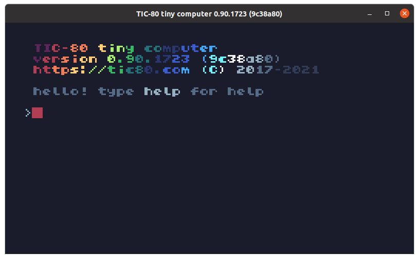
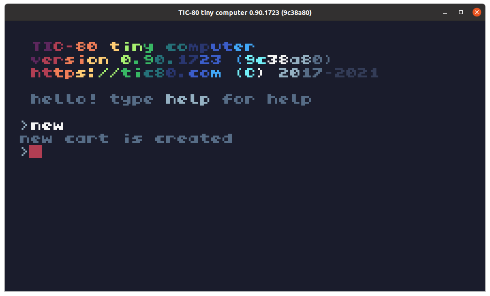

# 安装tic80

> * android

https://github.com/nesbox/TIC-80/releases/download/v0.90.1723/tic80-v0.90-android.apk

> * ubuntu

https://github.com/nesbox/TIC-80/releases/download/v0.90.1723/tic80-v0.90-linux.deb

> * mac

https://github.com/nesbox/TIC-80/releases/download/v0.90.1723/tic80-v0.90-mac.dmg

> * windows

https://github.com/nesbox/TIC-80/releases/download/v0.90.1723/tic80-v0.90-win.zip

它还有支持xp的版本

https://github.com/nesbox/TIC-80/releases/download/v0.90.1723/tic80-v0.90-winxp.zip

> * 其他版本

到 https://github.com/nesbox/TIC-80/releases 下载。

运行tic80，显示如下界面，它看起来就像一台8位计算机的开机界面。



输入`new`，可新建一个游戏。



其他命令：

载入游戏

```
load
```

保存游戏

```
save
```

运行游戏

```
run
```

常用快捷键

|  快捷键   | 功能   |
|----|----|
| F1 | 代码编辑 |
|F2|精灵编辑|
|F3|地图编辑|
|F4|声音编辑|
|F5|曲目编辑|
|ctrl + r|运行|
|ESC|退出到控制台|

