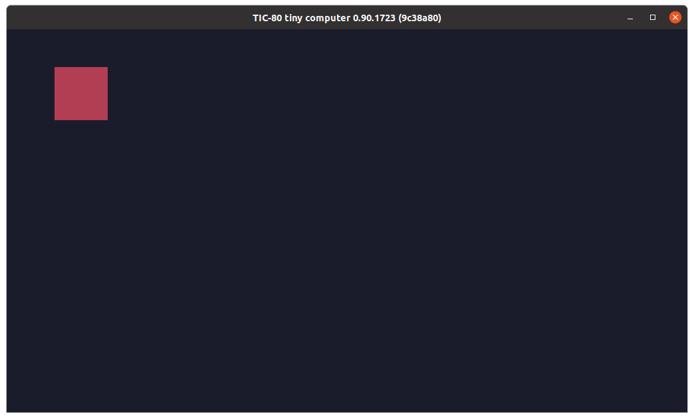
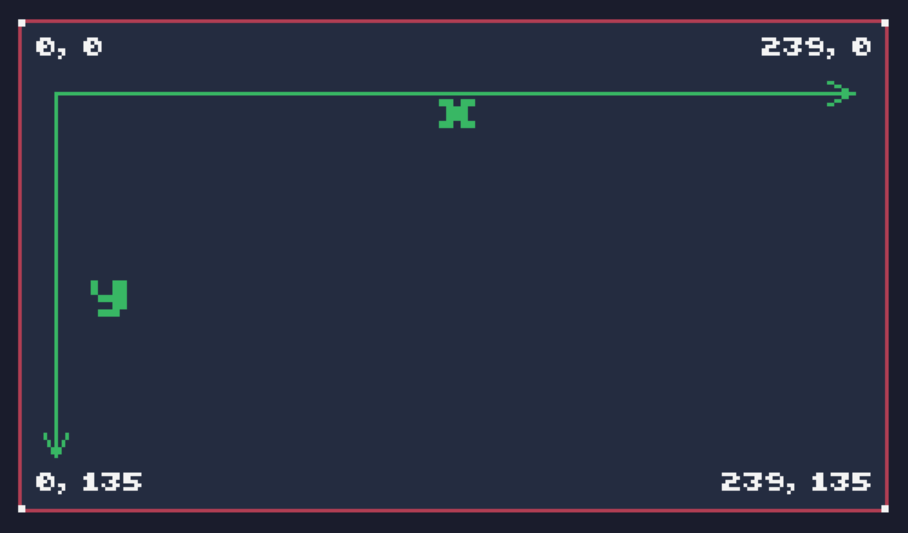

# 绘制一个红方块

输入`new`按回车，会新建一个游戏。按F1进入编辑，输入如下代码：

```lua
function TIC(
  cls(0) --用黑色清屏
  rect(10,10,20,20,2) --绘制方形
end
```

然后，按ctrl+r快捷键运行，会出现下面的效果：



其中，`TIC`是tic80的循环函数。游戏运行时，屏幕即是画布。人眼看到的游戏，是一个反复清除画布并重新绘制的过程。游戏中绘制任何东西，都需要写在一个循环的函数中。tic80的循环函数名称是`TIC`。

为了让游戏有更好的结构化，可以采用如下的代码结构：

```lua
function input()
    -- key event 键盘事件
end

function update()
    -- update 更新
end

function draw()
    -- draw 绘制
end

function TIC()
    input()
	update()
	cls(0)
	draw()
end
```

上面代码中，我们自定义了`update`和`draw`函数。并在`TIC`函数中，先执行`update`，然后执行`cls`清屏，最后执行`draw`绘制。

按照上面的结构，我们对代码稍加改造：

```lua
p={
  x=10,
  y=10,
  w=20,
  h=20,
  c=2,
  r="p" --role=player
}

function update()
    -- update
end

function draw()
    rect(p.x,p.y,p.w,p.h,p.c)
end

function TIC()
  input()
  update()
  cls(0)
  draw()
end
```

代码分析：

```lua
p={
  x=10,
  y=10,
  w=20,
  h=20,
  c=2,
  r="p" --role=player
}
```

p代表player，为了写代码方便所以没有写全称。w代表宽width，h代表高height，c代表颜色color。

`cls`清屏函数中，参数为颜色。0代表黑色。

`rect`是绘制方块函数，前两个参数代表`x`和`y`，也就是`位置坐标`。

tic80屏幕为240*136像素，坐标从`左上角（0,0）`开始，到`右下角（239,135）`结束。



坐标之后是大小，两个20代表宽度和高度为20。

最后一个参数代表颜色，从0-15一共16个颜色。2代表红色。

> rect(x坐标,y坐标,宽,高,颜色)

关于具体16色，可以参考下一篇，《16色》。

