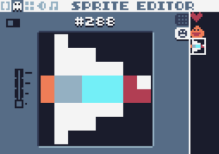
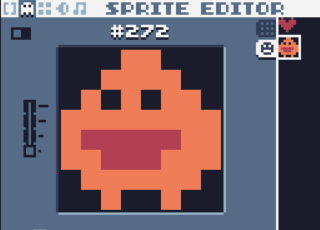
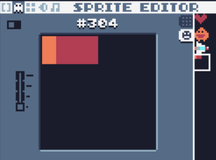
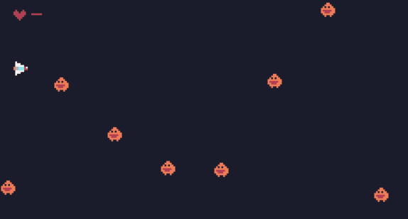

# 绘制精灵

目前，游戏可以玩，但只是方块不好看。

按F2，编辑精灵。

绘制玩家



绘制敌人



绘制炮弹



之前不论是玩家还是敌人，都有一个元素为c代表颜色的属性。现在要变为id，也就是sprite编辑器里的id。

玩家player：

```lua
p={
  x=10,
  y=10,
  vx=0,
  vy=0,
  w=8,
  h=8,
  i=288,--id #288
  b=20, --blood
  r="p" --role=player
}
```

敌人：

```lua
function newenemy()
  local e={
    w=8,
    h=8,
    x=239,
    y=math.random(0,135-20),
    vx=-1,
    vy=0,
    i=272,--id
    r="e" --role enemy
  }
  table.insert(gos,e) --add enemy to gameobjects
end
```

开火：

```lua
function fire()
  --bullet
  local b={
    w=2,
    h=2,
    x=p.x+p.w,
    y=p.y+p.h/2-1,
    vx=2,
    vy=0,
    r="b", --bullet
    i=304 --id
  }
  table.insert(gos,b)
end
```


然后，把`rect`绘制方块的方法替换为`spr`绘制精灵的方法。

```lua
function draw()
  for i,v in ipairs(gos) do
    spr(v.i,v.x,v.y,0,1,0,0,1,1) --使用spr方法代替之前的rect方法
  end
  draw_blood()
  if p.b==0 then
    draw_gameover()
  end
end
```

现在的效果：



