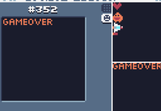

# 优化

目前，玩家是可以躲到屏幕外面的。

现在新建一个函数来解决这个问bug：

```lua
function stay_on_screen(v)
  if v.x<=0 then
    v.x=0
  end
  if v.y<=0 then
    v.y=0
  end
  if v.x>=239-v.w then
    v.x=239-v.w
  end
  if v.y>135-v.h then
    v.y=135-v.h
  end
end
```

在`update`中加入这个函数：

```lua
if v.r=="p" then
   stay_on_screen(v)
end
```

同样，如果是敌人超出了屏幕的左边界，则让它死掉，以防止卡顿：

```lua
if v.r=="e" and v.x<=-1*v.w then
  v.die=true
end
```

如果子弹超出了右边屏幕，则让子弹死掉：

```lua
if v.r=="b" and v.x>239 then
   v.die=true
end
```

这样，可以有效减少卡顿。

对于gameover，打出来的字太简陋了，所以还是用绘制的方式：



draw_gameover变为：

```lua
function draw_gameover()
  spr(352,20,20,0,2,0,0,22)
end
```

