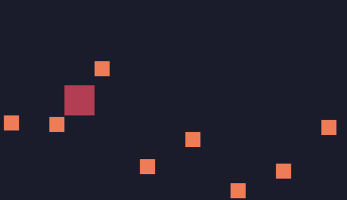

# 敌人

通常游戏里有7种角色：

1、玩家

2、敌人

3、食物（包括金币、血包、装备等）

4、自己发射的炮弹

5、敌人发射的炮弹

6、碰到后被阻挡的障碍物（比如墙）

7、碰到后会死或掉血的障碍物（比如深坑、河流）

我们用r="e"代表该角色为敌人，写一个产生敌人并加入到gos（gameobjects）的函数：

```lua
function newenemy()
  local e={
    x=239,
    y=math.random(0,135),
    vx=-1,
    vy=0,
    c=2,
    r="e" --role enemy
  }
  table.insert(gos,e) --add enemy to gameobjects
end
```

接下来，需要用到一个帧的概念。动画中，之所以能动起来，是因为一帧一帧的重复绘制。

因为游戏是一个循环绘制的过程，因此，每绘制一次，让一个变量自增，通过判断变量能被多少整除的形式，来确定一个时间间隔。这个时间间隔并不是秒或毫秒，而是循环了多少帧。

在TIC中，增加`t=t+1`

```lua
t=0
function TIC()
  t=t+1
  tup() --t update
  input()
  update()
  cls(0)
  draw()
end
```

之后，在`tup`中，用t来判断：

```lua
function tup()
  if t%50==0 then
    newenemy()
  end
end
```



可以看到，敌人与玩家相遇却穿梭而过。因为目前还没有做碰撞检测。请看下一篇《碰撞检测》。
