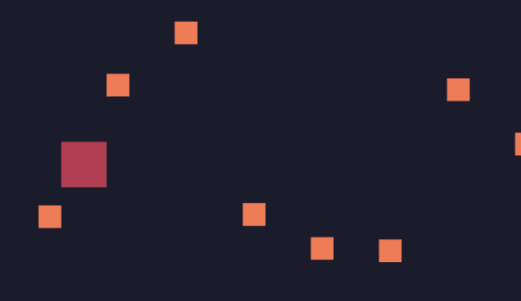

# 碰撞检测

从网络[1]找到一个碰撞检测方法：

```lua
function checkCollision(a, b)
    --With locals it's common usage to use underscores instead of camelCasing
    local a_left = a.x
    local a_right = a.x + a.w
    local a_top = a.y
    local a_bottom = a.y + a.h

    local b_left = b.x
    local b_right = b.x + b.w
    local b_top = b.y
    local b_bottom = b.y + b.h

    --Directly return this boolean value without using if-statement
    return  a_right > b_left
        and a_left < b_right
        and a_bottom > b_top
        and a_top < b_bottom
end
```

在`update`中进行碰撞检测，当发现角色为p的player玩家元素碰撞到角色为e的enemy敌人元素时，让enemy敌人消失（从table中移除）

```lua
function update()
  for i,v in ipairs(gos) do
    v.x=v.x+v.vx
    v.y=v.y+v.vy
    for ii,vv in ipairs(gos) do
      if checkCollision(v,vv) then
        if v.r=="p" and vv.r=="e" then
          vv.die=true --这里标记为该元素已经死亡
        end
      end
    end
  end
end
```

在update中，新增如下代码：

```lua
for i,v in ipairs(gos) do
    if v.die then
      table.remove(gos,i)
    end
end
```

上面的代码是循环找到标记死亡的元素，并删除。



参考[1] https://www.sheepolution.com/learn/book/13 

