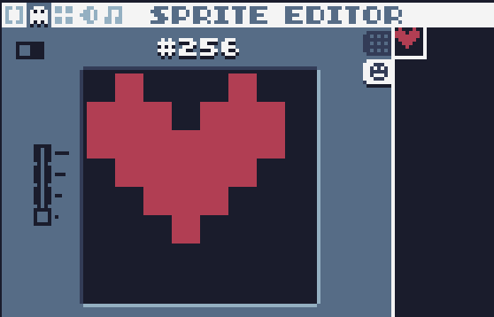

# 血条生命值

对p增加一个b属性为20，代表血为20。

```lua
p={
  x=10,
  y=10,
  vx=0,
  vy=0,
  w=20,
  h=20,
  c=2,
  b=20, --blood
  r="p" --role=player
}
```

`updte`变为：

```lua
function update()
  if p.b==0 then
    return false
  end
  for i,v in ipairs(gos) do
    v.x=v.x+v.vx
    v.y=v.y+v.vy
    for ii,vv in ipairs(gos) do
      if checkCollision(v,vv) then
        if v.r=="p" and vv.r=="e" then
          table.remove(gos,ii)
          v.b=v.b-1 --血条减少
        end
      end
    end
  end
end
```

按F2，进入精灵编辑。切换到精灵tab，在#256号区域绘制一个心形：



增加一个绘制血条的方法：

```lua
function draw_blood()
  -- draw blood
  spr(256,10,10,0,1,0,0,1,1)
  rect(20,12,p.b,1,2)
end
```

其中，`spr`为绘制精灵函数。

spr(精灵编号,x坐标,y坐标,透明色,缩放倍数,剪切x,剪切y,宽度,高度)

```
spr(256,10,10,0,1,0,0,1,1)
```

需要注意的是，在精灵编辑器中，8*8为1个格子。宽度8个像素占1格为1，如果16个像素则占2格为2。该参数为整数，不能有小数。

`draw`变为：

```lua
function draw()
  for i,v in ipairs(gos) do
    rect(v.x,v.y,v.w,v.h,v.c)
  end
  draw_blood()
end
```

此时，效果如下：


可以看到，当红色玩家遇见黄色敌人时，敌人消失，玩家血条会减少。

请继续阅读下一篇《游戏结束及重新开始》
