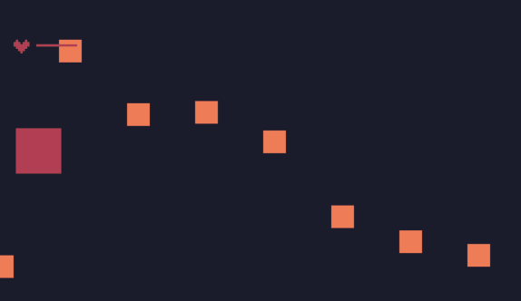

# 游戏结束及重新开始

游戏结束：

当玩家的血没了的时候，游戏结束：

```lua
function update()
  -- 新增代码如果没有血，则返回false，代表后面的代码不执行了
  if p.b==0 then
    return false
  end
  -- 之前的代码
end
```

新增一个`draw_gameover`函数：

```lua
function draw_gameover()
  print("Game Over",50,50,2)
end
```

在draw中判断：

```lua
function draw()
  for i,v in ipairs(gos) do
    rect(v.x,v.y,v.w,v.h,v.c)
  end
  draw_blood()
  -- 新增部分，判断如果血没了，就绘制gameover
  if p.b==0 then
    draw_gameover()
  end
end
```

重新开始：

```lua
function input()
  if btn(0) then
    p.vy=-1
  elseif btn(1) then
	p.vy=1
  elseif btn(2) then
	p.vx=-1
  elseif btn(3) then
    p.vx=1
  else
    p.vx=0
    p.vy=0
  end
  -- 如果玩家血没了 并且按了z键，则重新开始游戏
  if btn(4) and p.b==0 then
    reset() --restart game
  end	
end
```



