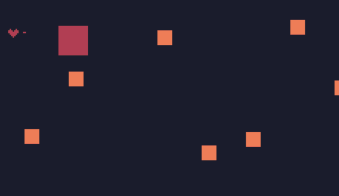

# 开火

在上一篇中，一个基本的游戏已经形成了。

但是，玩家应该能开火才能增加互动性。

在input函数中，增加：

```lua
if btnp(5) and p.b>0 then
  fire()
end
```

代表当玩家的血包大于0（活着）时，按x键开火。

> 注意，这里使用的是`btnp`，而不是`btn`。使用`btnp`可以避免按住时产生多次按动的效果。

相应地，新建一个fire函数：

```lua
function fire()
  --bullet
  local b={
    w=2,
    h=2,
    x=p.x+p.w,
    y=p.y+p.h/2-1,
    vx=2,
    vy=0,
    r="b", --bullet
    c=3
  }
  table.insert(gos,b)
end
```

同时，还要做子弹与敌人的碰撞检测。

找到这块代码：

```lua
if v.r=="p" and vv.r=="e" then
    vv.die=true
    v.b=v.b-2
end
```

在下面新增：

```lua
if v.r=="b" and vv.r=="e" then
     v.die=true
     vv.die=true
end
```

看下效果：




